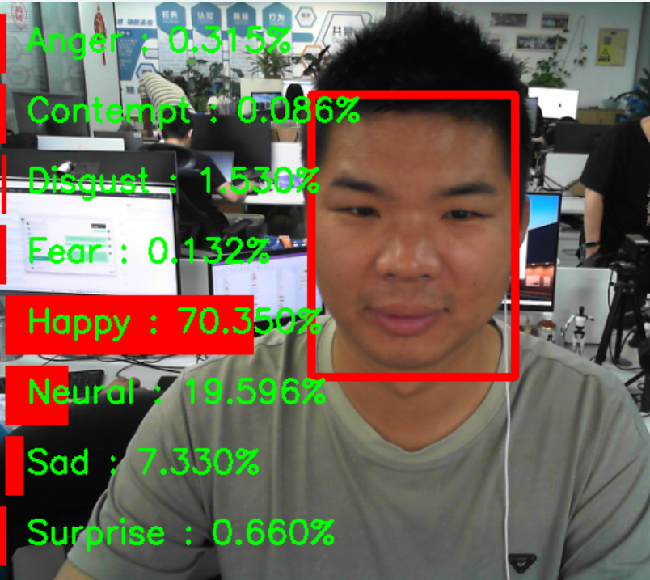

# EmotionsRecCNN

**基于深度卷积神经网络和注意力机制的面部表情识别系统**


---

## 目录

1. [项目介绍](#项目介绍)
2. [功能特性](#功能特性)
3. [项目结构](#项目结构)
4. [模型架构](#模型架构)
5. [环境配置](#环境配置)
6. [数据准备](#数据准备)
7. [训练模型](#训练模型)
8. [测试与推理](#测试与推理)
9. [ONNX部署](#onnx部署)
10. [配置说明](#配置说明)
11. [结果与性能](#结果与性能)
12. [参考文献](#参考文献)

---

## 项目介绍

EmotionsRecCNN 是一个基于深度卷积神经网络（CNN）的先进面部表情识别系统。本项目实现了一种新颖的**残差掩码网络（Residual Masking Network, ResMasking）**架构，将残差网络的强大能力与注意力机制相结合，在表情分类任务上取得了更高的准确率。

系统支持 8 种表情类别：
- 愤怒 (Anger)
- 蔑视 (Contempt)
- 厌恶 (Disgust)
- 恐惧 (Fear)
- 开心 (Happy)
- 中性 (Neural/Neutral)
- 悲伤 (Sad)
- 惊讶 (Surprise)

除了表情识别，项目还包含一个轻量级的人脸检测模块（SlimNet），用于实时处理管道。

### 演示结果



*图：实时面部表情识别演示，显示人脸检测边界框和表情概率可视化*

---

## 功能特性

### 核心功能

- **ResMasking 架构**：在 ResNet 的不同层级应用创新的注意力机制
- **多种骨干网络**：支持多种 ResNet 变体（ResNet-18、ResNet-34、ResNet-50 等）
- **数据增强**：使用 imgaug 内置的数据增强管道
- **优化训练**：支持 RAdam、AdamW 等现代优化器
- **早停与学习率调度**：带有平台检测的 ReduceLROnPlateau
- **实时推理**：同时支持 PyTorch 和 ONNX 推理
- **人脸检测管道**：集成 SlimNet 轻量级人脸检测器

### 技术亮点

- 基于注意力的特征细化
- Dropout 正则化提高泛化能力
- 批归一化和残差连接
- 全面的训练指标记录
- 检查点管理

---

## 项目结构

```
EmotionsRecCNN/
├── README.md                 # 项目文档（英文）
├── README-CN.md             # 项目文档（中文）
├── LICENSE                  # 许可证文件
├── checkpoints/             # 模型检查点和预训练权重
├── configs/
│   └── ck_config.json       # 训练配置文件
├── models/                  # 模型定义
│   ├── __init__.py
│   ├── resnet.py            # ResNet 基础模型
│   ├── resmasking.py        # ResMasking 架构
│   ├── resmasking_naive.py  # ResMasking 简单版本
│   ├── masking.py           # 掩码网络组件
│   ├── basic_layers.py      # 基础构建模块
│   └── utils.py             # 模型工具函数
├── trainers/                # 训练管道
│   ├── __init__.py
│   └── mydataset_trainer.py # 训练器类
├── utils/                   # 工具函数
│   ├── __init__.py
│   ├── radam.py             # RAdam 优化器实现
│   ├── generals.py          # 通用工具
│   ├── utils.py             # 其他工具
│   ├── augmenters/
│   │   └── augment.py       # 数据增强管道
│   ├── datasets/
│   │   ├── __init__.py
│   │   └── mydataset.py     # 数据集类
│   └── metrics/
│       ├── __init__.py
│       ├── metrics.py       # 分类指标
│       └── segment_metrics.py # 分割指标
└── tools/                   # 工具和脚本
    ├── _train.py            # 训练脚本
    ├── _test.py             # 测试/推理脚本（带摄像头）
    ├── Fps.py               # FPS 计算工具
    ├── net_slim.py          # SlimNet 人脸检测器
    ├── to_onnx.py           # 转换模型到 ONNX 格式
    ├── use_onnx.py          # ONNX 推理脚本
    └── util.py              # 检测工具函数
```

---

## 模型架构

### ResMasking 网络

ResMasking 网络是本项目的核心，基于 ResNet-34 构建，并在每一层应用注意力掩码模块。

#### 架构概览

```
输入图像 (3x224x224)
    ↓
Conv7x7 + 批归一化 + ReLU + 最大池化
    ↓
第1层 (64通道) + Masking4 → x*(1+m)
    ↓
第2层 (128通道) + Masking3 → x*(1+m)
    ↓
第3层 (256通道) + Masking2 → x*(1+m)
    ↓
第4层 (512通道) + Masking1 → x*(1+m)
    ↓
自适应平均池化 + 展平 + Dropout(0.4)
    ↓
线性层 (512 → 8类)
    ↓
Softmax → 表情概率
```

#### 残差掩码模块

项目实现了四种不同深度的掩码网络：

| 掩码模块 | 深度 | 编码器-解码器结构 |
|---------|------|-----------------|
| Masking1 | 1    | 单个块，无降采样 |
| Masking2 | 2    | 2级降采样 + 上采样 |
| Masking3 | 3    | 3级降采样 + 上采样 |
| Masking4 | 4    | 4级降采样 + 上采样 |

每个掩码模块使用类似 U-Net 的编码器-解码器结构，配合残差块来生成注意力图。

### SlimNet（人脸检测器）

基于深度可分离卷积的轻量级人脸检测网络，用于实时应用。

---

## 环境配置

### 依赖项

- Python 3.7+
- PyTorch 1.0+
- torchvision
- CUDA（推荐用于训练/推理）
- OpenCV (cv2)
- NumPy
- imgaug
- onnx（可选，用于 ONNX 导出）
- onnxruntime（可选，用于 ONNX 推理）

### 安装步骤

1. **克隆仓库**
   ```bash
   git clone <仓库地址>
   cd EmotionsRecCNN
   ```

2. **创建虚拟环境（推荐）**
   ```bash
   conda create -n emotions python=3.8
   conda activate emotions
   ```

3. **安装 PyTorch**
   - CUDA 版本：
     ```bash
     conda install pytorch torchvision torchaudio pytorch-cuda=11.8 -c pytorch -c nvidia
     ```
   - CPU 版本：
     ```bash
     conda install pytorch torchvision torchaudio cpuonly -c pytorch
     ```

4. **安装其他依赖**
   ```bash
   pip install opencv-python numpy imgaug
   pip install onnx onnxruntime-gpu  # 可选，用于 ONNX
   ```

---

## 数据准备

### 数据集结构

按照以下目录结构组织你的数据集：

```
your_dataset_path/
├── Anger/
│   ├── image1.jpg
│   ├── image2.png
│   └── ...
├── Contempt/
├── Disgust/
├── Fear/
├── Happy/
├── Neural/
├── Sad/
└── Surprise/
```

### 支持的图像格式

- JPEG (.jpg, .jpeg)
- PNG (.png)
- OpenCV 支持的其他常见图像格式

### 数据增强

训练管道包含使用 `imgaug` 的内置数据增强：

```python
seg = iaa.Sequential([
    iaa.Fliplr(p=0.5),              # 50% 概率水平翻转
    iaa.Affine(rotate=(-30, 30)),  # 随机旋转 (-30° 到 +30°)
])
```

**注意**：目前，数据增强在训练期间被应用，但在提供的代码中部分被注释掉了。根据需要取消注释其他增强方式。

---

## 训练模型

### 配置文件

在训练前，编辑 `configs/ck_config.json` 中的配置文件：

```json
{
    "image_size": 224,
    "in_channels": 3,
    "num_classes": 8,
    "arch": "resmasking_dropout",
    "lr": 0.0001,
    "momentum": 0.9,
    "weight_decay": 1e-4,
    "batch_size": 10,
    "num_workers": 0,
    "device": "cuda:0",
    "max_epoch_num": 80,
    "max_plateau_count": 20,
    "plateau_patience": 4,
    "data_path": "path/to/your/dataset",
    "weight_path": ""
}
```

### 关键配置参数

| 参数 | 描述 |
|------|------|
| `arch` | 使用的模型架构（推荐 `resmasking_dropout`） |
| `lr` | 初始学习率 |
| `batch_size` | 训练/验证的批次大小 |
| `device` | 使用的设备（`cuda:0` 或 `cpu`） |
| `max_epoch_num` | 最大训练轮数 |
| `max_plateau_count` | 在这么多轮没有改进后停止训练 |
| `plateau_patience` | 降低学习率前等待的轮数 |
| `data_path` | 数据集目录的路径 |
| `weight_path` | 预训练权重的路径（可选，用于微调） |

### 开始训练

```bash
cd tools
python _train.py
```

### 训练流程

训练管道包括：

1. **数据加载**：自动将数据集拆分为训练集（70%）和验证集（30%）
2. **训练循环**：
   - 前向传播
   - 损失计算（CrossEntropyLoss）
   - 反向传播
   - 优化器更新（Adam）
3. **验证**：每轮后在验证集上评估
4. **检查点保存**：基于验证准确率保存最佳模型
5. **学习率调度**：使用 ReduceLROnPlateau
6. **早停**：如果在 `max_plateau_count` 轮后没有改进则停止

### 训练输出

- 最佳模型权重保存到 `saved/checkpoints/`
- 控制台输出显示训练/验证损失和准确率
- 记录最佳性能指标

---

## 测试与推理

### 实时摄像头推理

`_test.py` 脚本提供从摄像头进行实时表情识别：

```bash
cd tools
python _test.py
```

#### 功能特性

- 使用 SlimNet 进行实时人脸检测
- 使用 ResMasking 进行表情分类
- 可视化边界框、表情标签和概率条
- 显示 8 种表情的概率
- FPS 监控（可选）

#### 工作原理

1. 从默认摄像头（设备 0）捕获视频
2. 使用 SlimNet 检测人脸
3. 对于每个检测到的人脸：
   - 裁剪并调整大小为 224x224
   - 归一化并通过 ResMasking 模型
   - 应用 softmax 获取概率
4. 在帧上绘制可视化
5. 显示结果

#### 自定义配置

- 要使用视频文件而不是摄像头，修改 `_test.py` 第 45 行：
  ```python
  cap = 'path/to/your/video.avi'
  ```
- 调整人脸检测置信度阈值（第 62 行）：
  ```python
  inds = np.where(scores > 0.999)[0]
  ```

### 批量推理

对于图像批量推理，你可以扩展提供的代码或创建自定义脚本。

---

## ONNX部署

### 导出为 ONNX

使用 `to_onnx.py` 将训练好的 PyTorch 模型转换为 ONNX 格式：

```bash
cd tools
python to_onnx.py
```

### ONNX 推理

使用 `use_onnx.py` 配合 ONNX Runtime 进行推理：

```bash
cd tools
python use_onnx.py
```

### ONNX 部署的优势

- 框架无关的部署
- 优化的推理性能
- 部署到各种平台（移动端、边缘设备、Web）
- 量化支持，进一步优化

---

## 配置说明

### 表情类别

8 种表情类别及其标签：

```python
Film_DICT = {
    0: "Anger",
    1: "Contempt",
    2: "Disgust",
    3: "Fear",
    4: "Happy",
    5: "Neural",
    6: "Sad",
    7: "Surprise",

    "Anger": 0,
    "Contempt": 1,
    "Disgust": 2,
    "Fear": 3,
    "Happy": 4,
    "Neural": 5,
    "Sad": 6,
    "Surprise": 7,
}
```

### 模型变体

项目支持多种模型变体：

1. **ResMasking** - 基础 ResMasking 架构
2. **ResMasking Dropout** - 在最终层前添加 dropout (0.4) 的 ResMasking
3. **ResMasking Naive** - 不应用掩码的简单版本（用于对比）

---

## 结果与性能

### 预期性能

在高质量数据集上进行适当训练后，你可以期望：

- **训练准确率**：>95%
- **验证准确率**：>85%（取决于数据集质量和大小）

### 性能优化建议

1. **数据质量**：高质量、平衡的数据集会产生最佳结果
2. **数据增强**：尝试更多增强方式（模糊、噪声、颜色抖动）
3. **学习率**：根据数据集大小进行调整
4. **批次大小**：更大的批次（如果内存允许）可以提高稳定性
5. **预训练权重**：考虑从类似任务的预训练模型进行微调

### 推理速度

- **GPU（NVIDIA）**：约 30-60 FPS（包括人脸检测）
- **CPU**：约 5-10 FPS

---

## 参考文献

### 论文

1. He, K., Zhang, X., Ren, S., & Sun, J. (2016). **Deep Residual Learning for Image Recognition**. CVPR.
   - [arXiv:1512.03385](https://arxiv.org/abs/1512.03385)

2. Liu, L., Jiang, H., He, P., Chen, W., Liu, X., Gao, J., & Han, J. (2019). **On the Variance of the Adaptive Learning Rate and Beyond**. ICLR.
   - [arXiv:1908.03265](https://arxiv.org/abs/1908.03265) (RAdam)

3. Loshchilov, I., & Hutter, F. (2019). **Decoupled Weight Decay Regularization**. ICLR.
   - [arXiv:1711.05101](https://arxiv.org/abs/1711.05101) (AdamW)

### 相关项目

- torchvision 的 ResNet 实现
- imgaug 数据增强库
- 用于模型导出的 ONNX

---

## 许可证

本项目采用 MIT 许可证 - 有关详细信息，请参阅 LICENSE 文件。

---

## 致谢

- 感谢 PyTorch 团队提供的出色深度学习框架
- 感谢 imgaug 和 ONNX 项目的贡献者
- 感谢计算机视觉研究社区的持续创新

---

## 贡献

欢迎贡献！请随时提交 Pull Request 或开 Issue。

---

## 联系方式

如有问题或疑问，请在 GitHub 上开 Issue。

---

**训练愉快！** 🎭😊
